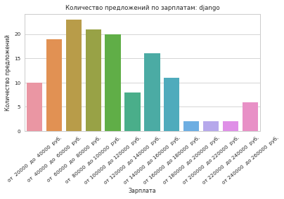
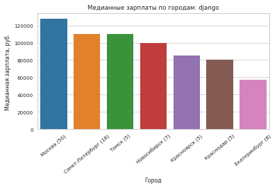

# ЛР №2 по Machine Learning

ИУ5-41, Водка Игорь


```python
import src.hh as hh
```

Зададим вакансию:


```python
vacancy = 'django'
```

Получим список вакансий:


```python
getter = hh.VacancyGetter(vacancy)
vacancies = getter.get_all_vacancies()
print("Прочитано {} вакансий".format(len(vacancies)))
```

    Прочитано 159 вакансий


Классифицируем полученные вакансии:


```python
classifier = hh.VacancyRangeClassifier(vacancies)
classes = classifier.classify()

drawer = hh.PlotDrawer(
    title='Количество предложений по зарплатам: {}'.format(vacancy),
    xlabel='Зарплата',
    ylabel='Количество предложений'
)
drawer.draw(classes)
```

    Зарплата от  20000  до  40000  руб.  - 10 предложений
    Зарплата от  40000  до  60000  руб.  - 19 предложений
    Зарплата от  60000  до  80000  руб.  - 23 предложений
    Зарплата от  80000  до 100000  руб.  - 21 предложений
    Зарплата от 100000  до 120000  руб.  - 20 предложений
    Зарплата от 120000  до 140000  руб.  - 8  предложений
    Зарплата от 140000  до 160000  руб.  - 16 предложений
    Зарплата от 160000  до 180000  руб.  - 11 предложений
    Зарплата от 180000  до 200000  руб.  - 2  предложений
    Зарплата от 200000  до 220000  руб.  - 2  предложений
    Зарплата от 220000  до 240000  руб.  - 2  предложений
    Зарплата от 240000  до 260000  руб.  - 6  предложений





Медианные зарплаты:


```python
classifier = hh.VacancyMedianClassifier(vacancies)
classes = classifier.classify()

classes = sorted(classes, key=lambda x: x['value'], reverse=True)
drawer = hh.PlotDrawer(
    title='Медианные зарплаты по городам: {}'.format(vacancy),
    xlabel='Город',
    ylabel='Медианная зарплата, руб.'
)
drawer.draw(classes[:10])
```

     8  вакансий =>     Екатеринбург имеет медианную зарплату 57500  
     5  вакансий =>        Краснодар имеет медианную зарплату 80000  
     5  вакансий =>       Красноярск имеет медианную зарплату 85000  
    50  вакансий =>           Москва имеет медианную зарплату 127500 
     7  вакансий =>      Новосибирск имеет медианную зарплату 100000 
    18  вакансий =>  Санкт-Петербург имеет медианную зарплату 110000 
     5  вакансий =>            Томск имеет медианную зарплату 110000 




